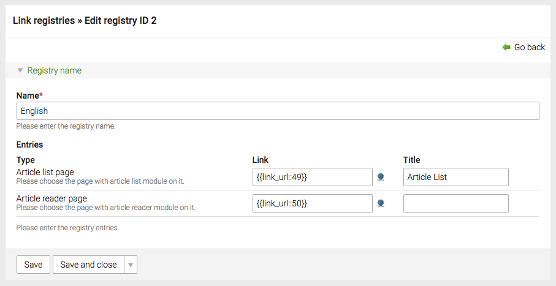

# Link Registry Bundle extension for Contao Open Source CMS

[](https://packagist.org/packages/codefog/contao-link-registry)
[](https://github.com/codefog/contao-link-registry/blob/master/LICENSE.txt)
[](https://packagist.org/packages/codefog/contao-link-registry)
[](https://travis-ci.org/codefog/contao-link-registry/)
[](https://coveralls.io/github/codefog/contao-link-registry)

Link Registry Bundle is an extension for the [Contao Open Source CMS](https://contao.org).

The extension provides a backend interface for managing particular website links in one place. It is especially
useful if you have a common page that needs to be linked from various places of your app.

For example, the login page can be referenced from various places. Instead of creating multiple references
(either ```{{link_*}}``` insert tags or ```jumpTo``` pages) you simply define it in one place and then refer to it
using the link registry.



## Documentation

1. [Installation](docs/01-installation.md)
2. [Configuration](docs/02-config.md)
3. [Usage](docs/03-usage.md)

## Copyright

This project has been created and is maintained by [Codefog](https://codefog.pl).
