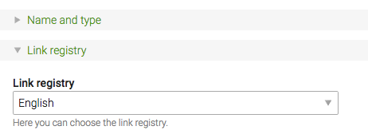

# Configuration – Link Registry Bundle

1. [Installation](01-installation.md)
2. [**Configuration**](02-config.md)
3. [Usage](03-usage.md)


## Configuration

Setup your desired page types in the file:

```yaml
# app/config/config.yml
cfg_link_registry:
    types: ["app_login", "app_logout", "app_profile"]
```

Make sure to also add the backend labels:
 
```php
// languages/en/tl_cfg_tags.php
$GLOBALS['TL_LANG']['tl_cfg_link_registry']['types'] = [
    'app_login'   => ['Login page', 'Please choose the page with login module on it.'],
    'app_logout'  => ['Logout page', 'Please choose the page with logout module on it.'],
    'app_profile' => ['Member profile page', 'Please choose the page with member profile module on it.'],
];
```


## Backend setup

In the backend first you have to create a registry in the ```Layout > Link registries``` module. Then in its settings
assign pages to the certain link types. You can assign internal pages as well as external URLs.


Once your registry is ready assign it in the website root settings.


